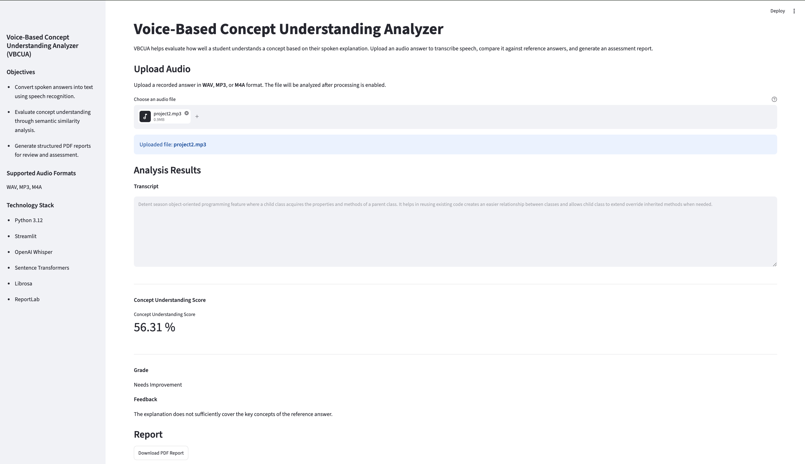
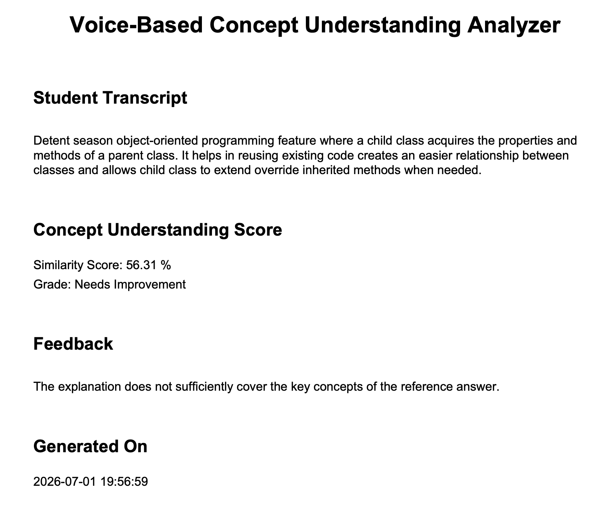

# 🎙️ Voice-Based Concept Understanding Analyzer (VBCUA)

An AI-powered educational application that evaluates a student's conceptual understanding from spoken answers using speech recognition, semantic similarity analysis, and automated assessment.

Voice-Based Concept Understanding Analyzer (VBCUA) converts a student's spoken explanation into text using OpenAI Whisper, compares it with a reference answer using Sentence Transformers, calculates a semantic similarity score, assigns a concept understanding grade with feedback, and generates a downloadable PDF report through an interactive Streamlit interface.

---

## 🚀 Key Highlights

- 🎤 Speech-to-text transcription using OpenAI Whisper
- 🧠 Semantic similarity analysis using Sentence Transformers
- 📊 Automated concept understanding score
- 🏆 Automatic grading and feedback generation
- 📄 Professional PDF report generation
- 💻 Interactive Streamlit web interface

---

## ✨ Features

- Upload audio files (WAV, MP3, M4A)
- Automatic speech-to-text transcription
- Semantic comparison with reference answers
- Concept understanding score calculation
- Grade and personalized feedback generation
- Downloadable PDF assessment report
- Clean and interactive Streamlit interface

---

## 🛠️ Tech Stack

| Category | Technology |
|----------|------------|
| Language | Python 3.12 |
| Frontend | Streamlit |
| Speech Recognition | OpenAI Whisper |
| Semantic Analysis | Sentence Transformers |
| Audio Processing | Librosa |
| PDF Generation | ReportLab |

---

## 📂 Project Structure

```text
Voice-Based-Concept-Analyzer/
│
├── app/                         # Application source code
│   ├── modules/                 # AI processing modules
│   │   ├── transcriber.py
│   │   ├── semantic_analyzer.py
│   │   ├── concept_scorer.py
│   │   └── report_generator.py
│   │
│   ├── ui/                      # Streamlit UI components
│   ├── utils/                   # Utility functions
│   ├── config.py                # Application configuration
│   └── main.py                  # Application entry point
│
├── assets/                      # Images and icons
├── data/
│   ├── audio/                   # Uploaded audio files
│   └── reference_answers/       # Ground-truth answers
│
├── reports/                     # Generated PDF reports
├── docs/                        # Documentation
├── tests/                       # Unit tests
├── requirements.txt
├── .gitignore
└── README.md
```

---

## 🖼️ Application Preview



---

## 📄 Generated PDF Report



---

## ⚙️ Project Workflow

```text
               Upload Audio
                     │
                     ▼
      OpenAI Whisper (Speech-to-Text)
                     │
                     ▼
             Speech Transcript
                     │
                     ▼
            Load Reference Answer
                     │
                     ▼
    Sentence Transformers Embeddings
                     │
                     ▼
       Semantic Similarity Analysis
                     │
                     ▼
        Concept Understanding Score
                     │
                     ▼
          Grade & Feedback Generation
                     │
                     ▼
          PDF Report Generation
                     │
                     ▼
          Download Assessment Report
```

---

## 🏗️ Project Architecture

The application follows a modular architecture where each stage of the processing pipeline is implemented independently. Speech recognition, semantic analysis, concept scoring, report generation, and the user interface are separated into dedicated modules, making the project easier to maintain, extend, and test.

---

## 📊 Sample Output

```text
Concept Understanding Score : 97.77%

Grade : Excellent

Feedback :
The explanation closely matches the reference answer and demonstrates excellent conceptual understanding.
```

---

## 🚀 Installation

Clone the repository

```bash
git clone https://github.com/krishnavamsivemula-cyber/Voice-Based-Concept-Analyzer.git
```

Move into the project directory

```bash
cd Voice-Based-Concept-Analyzer
```

Create a virtual environment

```bash
python -m venv .venv
```

Activate the virtual environment

**macOS / Linux**

```bash
source .venv/bin/activate
```

**Windows**

```bash
.venv\Scripts\activate
```

Install the required dependencies

```bash
pip install -r requirements.txt
```

Run the application

```bash
streamlit run app/main.py
```

---

## 🎵 Supported Audio Formats

- WAV
- MP3
- M4A

---

## 🔮 Future Enhancements

- Real-time microphone recording
- Support for multiple reference answers
- Multi-language support
- Student performance dashboard
- Database integration
- Cloud deployment
- Authentication and user management

---

## 👥 Contributors

This project was developed collaboratively as part of an AI-based educational application. Team members contributed to different aspects of the project, including application design, implementation, testing, and documentation.

---

## 📜 License

This project is intended for educational and academic purposes.